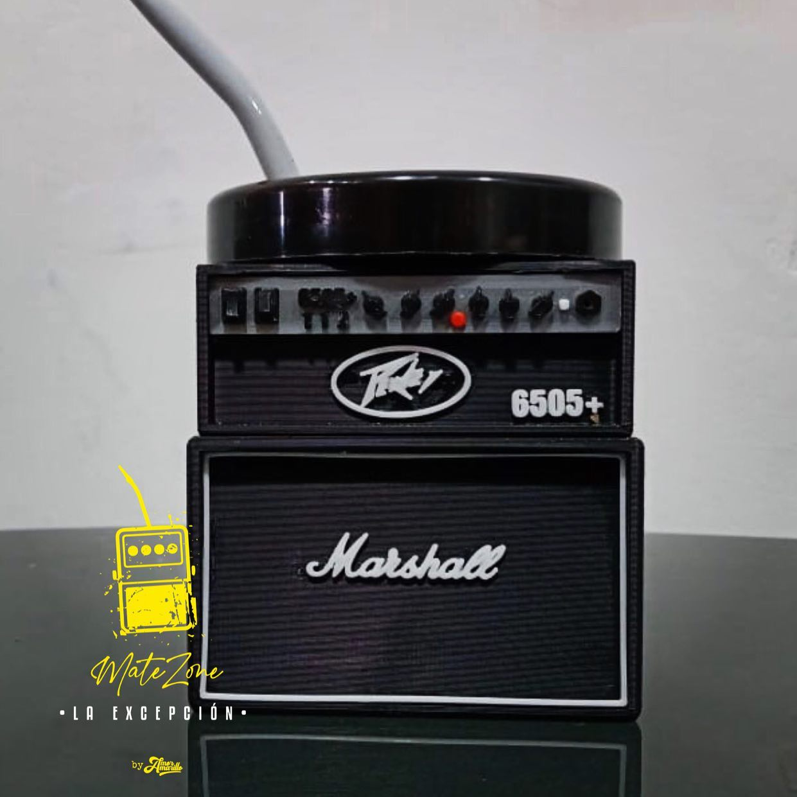
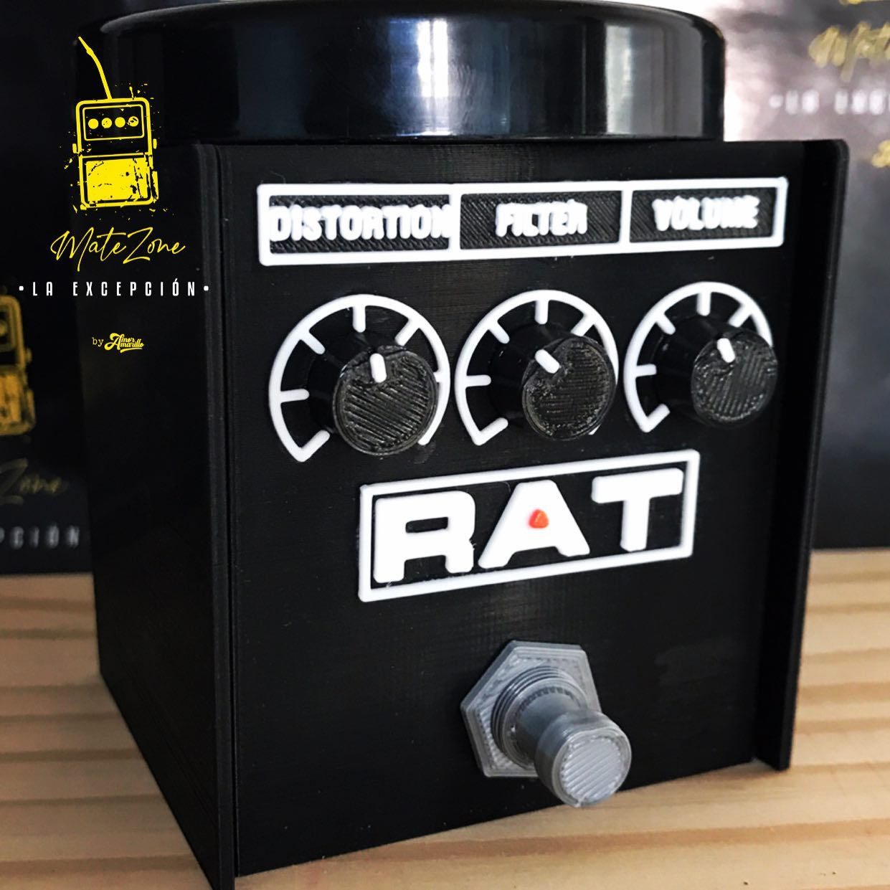
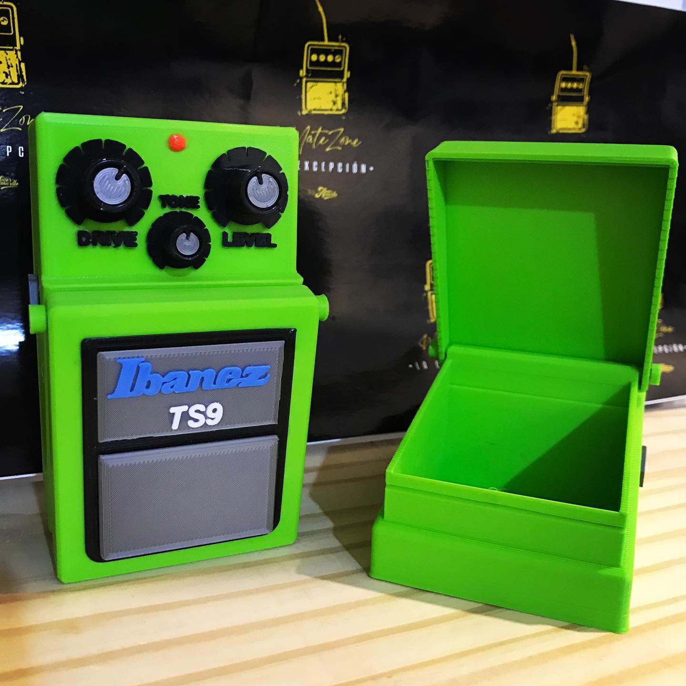

# README - Página Web MateZone

## Descripción General

Bienvenido a MateZone, un sitio web dedicado a impresion de mates y portapuas en 3D.

## Instrucciones de Uso

### Inicio Rápido

Visita nuestra página principal en https://matezone.netlify.app/  

### Secciones Principales

- **Mate Amp**: Mates impresos en 3d con forma de amplificadores de guitarra y bajo.
- **Mate Pedal**: Mates impresos en 3d con forma de pedales.
- **PortaPuas**: Portapuas o contenedores para puas, impresos en 3D, creados para disimularse en una pedalera.
- **Preguntas**: Aqui podras ver las preguntas frecuentes y hacernos llegar tus dudas.
- **Como lo hacemos?**: Mostramos nuestros primeros modelos desde el inicio, hasta los ultimos modelos que estan en desarrollo.

### Tecnicas utilizadas

-Flexbox
-Grid
-BS

### Tecnologias

-Html5
-Css
-Sass
-Git
-Nodejs

## Contacto

Para colaboraciones, preguntas o sugerencias, contáctanos a través de (dario.1992.marquez@gmail.com)

## Créditos

Desarrollado por Marquez Dario.

